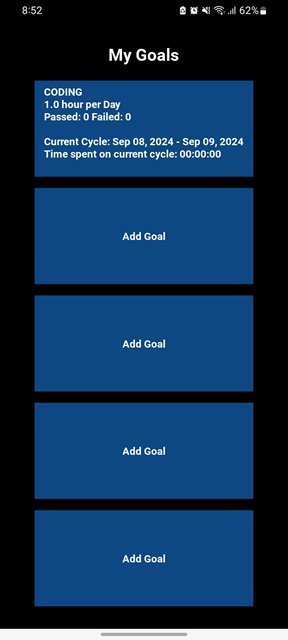
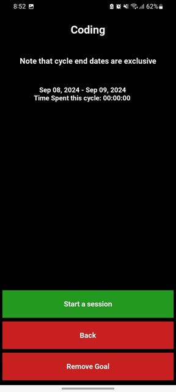
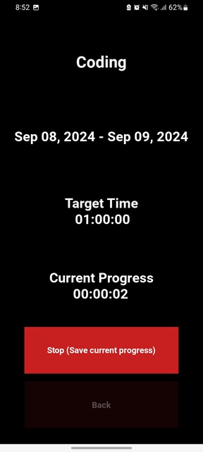

To ues this app on your android device, download the `bin/android_package.apk` file onto your phone. Locate and select the file on your phone, and then select `install app`. 

## Overview
This app can be used to create measurable time-based goals (example: read for 30 minutes per day). 
Set a title, type (daily, weekly, or monthly), and a target number of hours for your goal. Whenever you are working on the goal, start a session and the app will keep track of how much time you spend working towards your goal. 

## Main Menu

This screen will initially show 5 empty goal items, which you can replace with up to 5 of your own custom goals. To add a goal to one of the 5 slots, simply click on one of the buttons witht he text `Add Goal`. Once you have added some goald, this screen will display each one of your goals, along with some brief information on each. To view more deatils about an individual goal, or to start a session on one of your goals, simply click on that goal and you will be taken to its detais page.

## Goal Creation Page

Here you will choose the details of your goal. Each goal includes a title, a type, and a target number of hours. The goal type determinies how long each "cycle" of your goal will be. For example, if  you choose a weekly goal type, and set your target number of hours to 3, then your goal will be 3 hours every week. 

## Goal Details Page

After selecting a goal from the main menu, you will taken a page that displays the date ranges for each cycle (day, week, or month) of that goal, along with the amount of time that you spent on the goal during that particular cycle. Cycles where you hit your target number of hours will be shown in green text, and cycles where you did not hit your target will be shown in red text. From this page, you can also delete the selected goal, or start a session by hitting the button that reads `Start a Session`. 

## Session Page

When you are working on a particular goal, you will want to come to this page so that you can keep track of your time. Simply hit the `Start` button and the app will begin tracking your time. When you are done working on the goal, hit the button that reads `Stop (Save current progress)`. The app will remember the amount of time you spent on the goal and will count it towards your total number of hours for the current cycle. 

